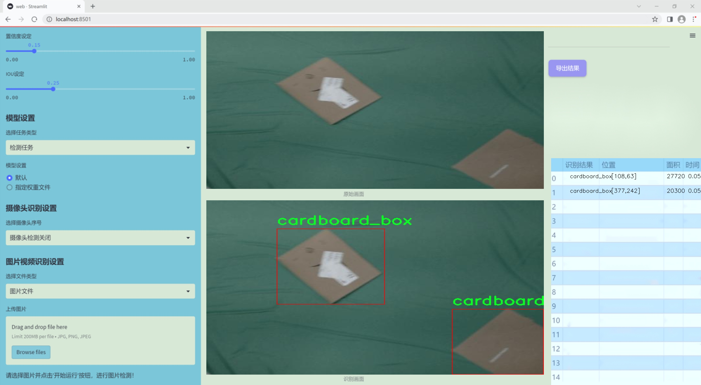
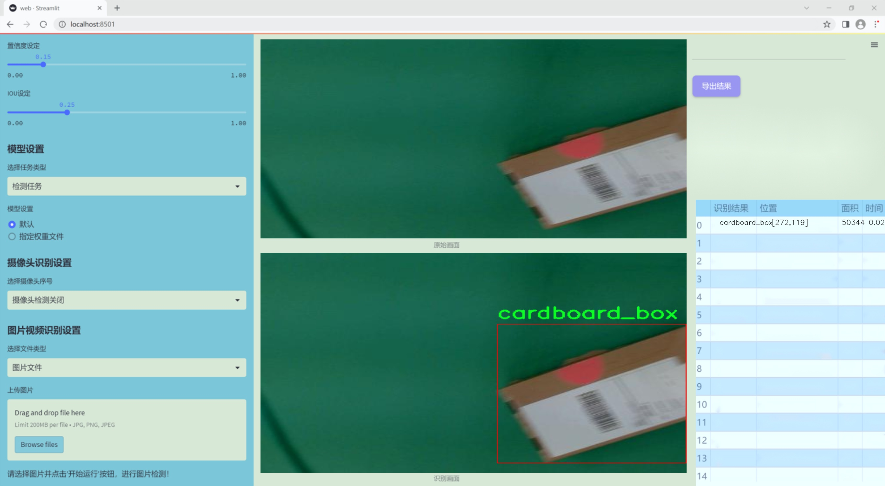
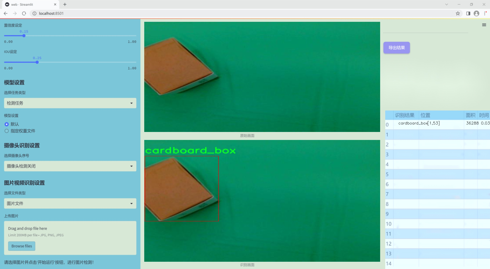
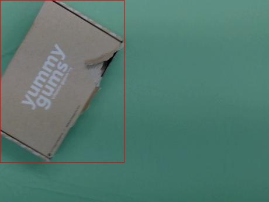
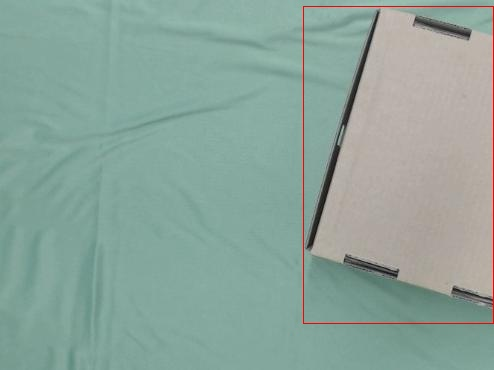
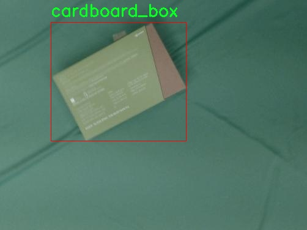
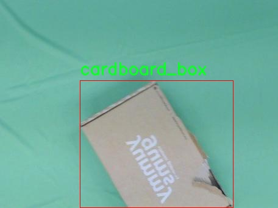

# 改进yolo11-DySnakeConv等200+全套创新点大全：快递盒纸箱检测系统源码＆数据集全套

### 1.图片效果展示







##### 项目来源 **[人工智能促进会 2024.10.23](https://kdocs.cn/l/cszuIiCKVNis)**

注意：由于项目一直在更新迭代，上面“1.图片效果展示”和“2.视频效果展示”展示的系统图片或者视频可能为老版本，新版本在老版本的基础上升级如下：（实际效果以升级的新版本为准）

  （1）适配了YOLOV11的“目标检测”模型和“实例分割”模型，通过加载相应的权重（.pt）文件即可自适应加载模型。

  （2）支持“图片识别”、“视频识别”、“摄像头实时识别”三种识别模式。

  （3）支持“图片识别”、“视频识别”、“摄像头实时识别”三种识别结果保存导出，解决手动导出（容易卡顿出现爆内存）存在的问题，识别完自动保存结果并导出到tempDir中。

  （4）支持Web前端系统中的标题、背景图等自定义修改。

  另外本项目提供训练的数据集和训练教程,暂不提供权重文件（best.pt）,需要您按照教程进行训练后实现图片演示和Web前端界面演示的效果。

### 2.视频效果展示

[2.1 视频效果展示](https://www.bilibili.com/video/BV1Jz1KY6E2d/)

### 3.背景

研究背景与意义

随着电子商务的迅猛发展，快递行业的包裹数量日益增加，随之而来的快递盒和纸箱的回收与处理问题也愈发突出。传统的人工检测方法不仅效率低下，而且容易受到人为因素的影响，导致检测结果的不准确性。因此，开发一种高效、准确的快递盒纸箱检测系统显得尤为重要。基于此背景，本文提出了一种改进的YOLOv11模型，旨在实现对快递盒和纸箱的自动化检测。

YOLO（You Only Look Once）系列模型因其在实时目标检测中的优越性能而受到广泛关注。YOLOv11作为该系列的最新版本，具备更高的检测精度和更快的处理速度，适合于快递盒纸箱这一特定场景的检测需求。通过对YOLOv11模型的改进，我们可以更好地适应快递盒的多样性和复杂性，从而提高检测的准确性和鲁棒性。

本研究所使用的数据集包含676张快递盒和纸箱的图像，主要针对“cardboard_box”这一类别进行训练和测试。虽然数据集的规模相对较小，但通过数据增强技术和模型优化，我们能够有效提升模型的泛化能力。此外，针对快递盒的不同形状、尺寸和材质，改进后的YOLOv11模型将能够在各种环境下进行准确的检测，满足实际应用需求。

综上所述，基于改进YOLOv11的快递盒纸箱检测系统不仅能够提高检测效率，降低人工成本，还能为快递行业的可持续发展提供技术支持，具有重要的现实意义和应用前景。通过该研究，我们希望能够为快递盒的回收利用提供更为科学的解决方案，推动快递行业的绿色发展。

### 4.数据集信息展示

##### 4.1 本项目数据集详细数据（类别数＆类别名）

nc: 1
names: ['cardboard_box']


该项目为【目标检测】数据集，请在【训练教程和Web端加载模型教程（第三步）】这一步的时候按照【目标检测】部分的教程来训练

##### 4.2 本项目数据集信息介绍

本项目数据集信息介绍

在本项目中，我们使用的数据集名为“Box detection”，其主要目的是为了训练和改进YOLOv11模型，以实现高效的快递盒纸箱检测系统。该数据集专注于单一类别的物体检测，具体类别为“cardboard_box”，这意味着我们将专注于识别和定位纸箱在不同环境和场景中的表现。数据集的设计旨在提供丰富的样本，以确保模型能够在多样化的背景下准确识别纸箱。

“Box detection”数据集包含了大量的标注图像，这些图像涵盖了各种不同的快递盒纸箱样式、尺寸和颜色，旨在模拟实际快递物流场景中可能遇到的各种情况。数据集中的图像来源广泛，包括室内和室外环境，能够有效地反映出快递盒在不同光照条件、角度和背景下的特征。这种多样性不仅增强了模型的鲁棒性，还提高了其在实际应用中的适应能力。

在数据集的构建过程中，我们严格遵循了标注规范，确保每个图像中的纸箱都得到了准确的标注。通过使用高质量的图像和精确的标注信息，我们期望训练出的YOLOv11模型能够在实时检测中表现出色，快速而准确地识别出快递盒纸箱。这对于提升快递物流的自动化水平、减少人工干预和提高工作效率具有重要意义。

综上所述，“Box detection”数据集不仅为YOLOv11模型的训练提供了坚实的基础，也为未来在快递行业的应用提供了广阔的前景。通过不断优化和迭代，我们相信该检测系统将能够在实际操作中发挥出更大的价值。










### 5.全套项目环境部署视频教程（零基础手把手教学）

[5.1 所需软件PyCharm和Anaconda安装教程（第一步）](https://www.bilibili.com/video/BV1BoC1YCEKi/?spm_id_from=333.999.0.0&vd_source=bc9aec86d164b67a7004b996143742dc)


[5.2 安装Python虚拟环境创建和依赖库安装视频教程（第二步）](https://www.bilibili.com/video/BV1ZoC1YCEBw?spm_id_from=333.788.videopod.sections&vd_source=bc9aec86d164b67a7004b996143742dc)

### 6.改进YOLOv11训练教程和Web_UI前端加载模型教程（零基础手把手教学）

[6.1 改进YOLOv11训练教程和Web_UI前端加载模型教程（第三步）](https://www.bilibili.com/video/BV1BoC1YCEhR?spm_id_from=333.788.videopod.sections&vd_source=bc9aec86d164b67a7004b996143742dc)


按照上面的训练视频教程链接加载项目提供的数据集，运行train.py即可开始训练



     Epoch   gpu_mem       box       obj       cls    labels  img_size
     1/200     20.8G   0.01576   0.01955  0.007536        22      1280: 100%|██████████| 849/849 [14:42<00:00,  1.04s/it]
               Class     Images     Labels          P          R     mAP@.5 mAP@.5:.95: 100%|██████████| 213/213 [01:14<00:00,  2.87it/s]
                 all       3395      17314      0.994      0.957      0.0957      0.0843

     Epoch   gpu_mem       box       obj       cls    labels  img_size
     2/200     20.8G   0.01578   0.01923  0.007006        22      1280: 100%|██████████| 849/849 [14:44<00:00,  1.04s/it]
               Class     Images     Labels          P          R     mAP@.5 mAP@.5:.95: 100%|██████████| 213/213 [01:12<00:00,  2.95it/s]
                 all       3395      17314      0.996      0.956      0.0957      0.0845

     Epoch   gpu_mem       box       obj       cls    labels  img_size
     3/200     20.8G   0.01561    0.0191  0.006895        27      1280: 100%|██████████| 849/849 [10:56<00:00,  1.29it/s]
               Class     Images     Labels          P          R     mAP@.5 mAP@.5:.95: 100%|███████   | 187/213 [00:52<00:00,  4.04it/s]
                 all       3395      17314      0.996      0.957      0.0957      0.0845


###### [项目数据集下载链接](https://kdocs.cn/l/cszuIiCKVNis)

### 7.原始YOLOv11算法讲解

YOLOv11是一种由Ultralytics公司开发的最新一代目标检测模型，以其增强的特征提取能力和更高的效率在计算机视觉领域引人注目。该模型在架构上进行了关键升级，通过更新主干和颈部结构，显著提高了对复杂视觉场景的理解和处理精度。YOLOv11不仅在目标检测上表现出色，还支持实例分割、图像分类、姿态估计和定向目标检测（OBB）等任务，展示出其多功能性。

与其前身YOLOv8相比，YOLOv11在设计上实现了深度和宽度的改变，同时引入了几个创新机制。其中，C3k2机制是对YOLOv8中的C2f的改进，提升了浅层特征的处理能力；C2PSA机制则进一步优化了特征图的处理流程。解耦头的创新设计，通过增加两个深度卷积（DWConv），提高了模型对细节的感知能力和分类准确性。

在性能上，YOLOv11m模型在COCO数据集上的平均精度（mAP）提高，并减少了22%的参数量，确保了在运算效率上的突破。该模型可以部署在多种平台上，包括边缘设备、云平台以及支持NVIDIA GPU的系统，彰显出卓越的灵活性和适应性。总体而言，YOLOv11通过一系列的创新突破，对目标检测领域产生了深远的影响，并为未来的开发提供了新的研究方向。


****文档**** ： _ _https://docs.ultralytics.com/models/yolo11/__

****代码链接**** ： _ _https://github.com/ultralytics/ultralytics__

******Performance Metrics******


​ ** **关键特性****

****◆**** ** **增强的特征提取能力**** ：YOLO11采用了改进的主干和颈部架构，增强了 ** **特征提取****
能力，能够实现更精确的目标检测和复杂任务的执行。

****◆**** ** **优化的效率和速度****
：YOLO11引入了精细化的架构设计和优化的训练流程，提供更快的处理速度，并在准确性和性能之间保持最佳平衡。

****◆**** ** **参数更少、精度更高****
：通过模型设计的改进，YOLO11m在COCO数据集上实现了更高的平均精度（mAP），同时使用的参数比YOLOv8m少22%，使其在计算上更加高效，而不牺牲准确性。

****◆**** ** **跨环境的适应性**** ：YOLO11可以无缝部署在各种环境中，包括边缘设备、云平台和支持NVIDIA
GPU的系统，确保最大的灵活性。

****◆**** ** **支持广泛任务****
：无论是目标检测、实例分割、图像分类、姿态估计还是定向目标检测（OBB），YOLO11都旨在应对一系列计算机视觉挑战。

****支持的任务和模式****


​YOLO11建立在YOLOv8中引入的多功能模型范围之上，为各种计算机视觉任务提供增强的支持:


​该表提供了YOLO11模型变体的概述，展示了它们在特定任务中的适用性以及与Inference、Validation、Training和Export等操作模式的兼容性。从实时检测到复杂的分割任务
，这种灵活性使YOLO11适用于计算机视觉的广泛应用。

##### yolov11的创新

■ yolov8 VS yolov11

YOLOv5，YOLOv8和YOLOv11均是ultralytics公司的作品，ultralytics出品必属精品。


​ **具体创新点** ：

**① 深度（depth）和宽度 （width）**

YOLOv8和YOLOv11是基本上完全不同。

**② C3k2机制**

C3k2有参数为c3k，其中在网络的浅层c3k设置为False。C3k2就相当于YOLOv8中的C2f。


​ **③ C2PSA机制**

下图为C2PSA机制的原理图。


​ **④ 解耦头**

解耦头中的分类检测头增加了两个 **DWConv** 。


▲Conv

    
    
    def autopad(k, p=None, d=1):  # kernel, padding, dilation
    
        """Pad to 'same' shape outputs."""
    
        if d > 1:
    
            k = d * (k - 1) + 1 if isinstance(k, int) else [d * (x - 1) + 1 for x in k]  # actual kernel-size
    
        if p is None:
    
            p = k // 2 if isinstance(k, int) else [x // 2 for x in k]  # auto-pad
    
    return p
    
    
    class Conv(nn.Module):
    
        """Standard convolution with args(ch_in, ch_out, kernel, stride, padding, groups, dilation, activation)."""
    
    
        default_act = nn.SiLU()  # default activation
    
    
        def __init__(self, c1, c2, k=1, s=1, p=None, g=1, d=1, act=True):
    
            """Initialize Conv layer with given arguments including activation."""
    
            super().__init__()
    
            self.conv = nn.Conv2d(c1, c2, k, s, autopad(k, p, d), groups=g, dilation=d, bias=False)
    
            self.bn = nn.BatchNorm2d(c2)
    
            self.act = self.default_act if act is True else act if isinstance(act, nn.Module) else nn.Identity()
    
    
        def forward(self, x):
    
            """Apply convolution, batch normalization and activation to input tensor."""
    
            return self.act(self.bn(self.conv(x)))
    
    
        def forward_fuse(self, x):
    
            """Perform transposed convolution of 2D data."""
    
            return self.act(self.conv(x))

▲Conv2d

    
    
    torch.nn.Conv2d(in_channels, out_channels, kernel_size, stride=1, padding=0, dilation=1, groups=1, bias=True, padding_mode='zeros')

▲DWConv

DWConv ** **代表 Depthwise Convolution（深度卷积）****
，是一种在卷积神经网络中常用的高效卷积操作。它主要用于减少计算复杂度和参数量。

    
    
    class DWConv(Conv):
    
        """Depth-wise convolution."""
    
    
        def __init__(self, c1, c2, k=1, s=1, d=1, act=True):  # ch_in, ch_out, kernel, stride, dilation, activation
    
            """Initialize Depth-wise convolution with given parameters."""
    
            super().__init__(c1, c2, k, s, g=math.gcd(c1, c2), d=d, act=act)


### 8.200+种全套改进YOLOV11创新点原理讲解

#### 8.1 200+种全套改进YOLOV11创新点原理讲解大全

由于篇幅限制，每个创新点的具体原理讲解就不全部展开，具体见下列网址中的改进模块对应项目的技术原理博客网址【Blog】（创新点均为模块化搭建，原理适配YOLOv5~YOLOv11等各种版本）

[改进模块技术原理博客【Blog】网址链接](https://gitee.com/qunmasj/good)


#### 8.2 精选部分改进YOLOV11创新点原理讲解

###### 这里节选部分改进创新点展开原理讲解(完整的改进原理见上图和[改进模块技术原理博客链接](https://gitee.com/qunmasj/good)【如果此小节的图加载失败可以通过CSDN或者Github搜索该博客的标题访问原始博客，原始博客图片显示正常】


### D-LKA Attention简介
自2010年代中期以来，卷积神经网络（CNNs）已成为许多计算机视觉应用的首选技术。它们能够从原始数据中自动提取复杂的特征表示，无需手动进行特征工程，这引起了医学图像分析社区的极大兴趣。许多成功的CNN架构，如U-Net、全卷积网络、DeepLab或SegCaps（分割胶囊），已经被开发出来。这些架构在语义分割任务中取得了巨大成功，先前的最新方法已经被超越。

在计算机视觉研究中，不同尺度下的目标识别是一个关键问题。在CNN中，可检测目标的大小与相应网络层的感受野尺寸密切相关。如果一个目标扩展到超出这个感受野的边界，这可能会导致欠分割结果。相反，与目标实际大小相比使用过大的感受野可能会限制识别，因为背景信息可能会对预测产生不必要的影响。

解决这个问题的一个有希望的方法涉及在并行使用具有不同尺寸的多个Kernel，类似于Inception块的机制。然而，由于参数和计算要求的指数增长，将Kernel大小增加以容纳更大的目标在实践中受到限制。因此，出现了各种策略，包括金字塔池化技术和不同尺度的扩张卷积，以捕获多尺度的上下文信息。

另一个直观的概念涉及将多尺度图像金字塔或它们的相关特征表示直接纳入网络架构。然而，这种方法存在挑战，特别是在管理训练和推理时间方面的可行性方面存在挑战。在这个背景下，使用编码器-解码器网络，如U-Net，已被证明是有利的。这样的网络在较浅的层中编码外观和位置，而在更深的层中，通过神经元的更广泛的感受野捕获更高的语义信息和上下文信息。

一些方法将来自不同层的特征组合在一起，或者预测来自不同尺寸的层的特征以使用多尺度的信息。此外，出现了从不同尺度的层中预测特征的方法，有效地实现了跨多个尺度的见解整合。然而，大多数编码器-解码器结构面临一个挑战：它们经常无法在不同尺度之间保持一致的特征，并主要使用最后一个解码器层生成分割结果。

语义分割是一项任务，涉及根据预定义的标签集为图像中的每个像素预测语义类别。这项任务要求提取高级特征同时保留初始的空间分辨率。CNNs非常适合捕获局部细节和低级信息，尽管以忽略全局上下文为代价。视觉Transformer（ViT）架构已经成为解决处理全局信息的视觉任务的关键，包括语义分割，取得了显著的成功。

ViT的基础是注意力机制，它有助于在整个输入序列上聚合信息。这种能力使网络能够合并远程的上下文提示，超越了CNN的有限感受野尺寸。然而，这种策略通常会限制ViT有效建模局部信息的能力。这种局限可能会妨碍它们检测局部纹理的能力，这对于各种诊断和预测任务至关重要。这种缺乏局部表示可以归因于ViT模型处理图像的特定方式。

ViT模型将图像分成一系列Patch，并使用自注意力机制来模拟它们之间的依赖关系。这种方法可能不如CNN模型中的卷积操作对感受野内提取局部特征有效。ViT和CNN模型之间的这种图像处理方法的差异可能解释了CNN模型在局部特征提取方面表现出色的原因。

近年来，已经开发出创新性方法来解决Transformer模型内部局部纹理不足的问题。其中一种方法是通过互补方法将CNN和ViT特征结合起来，以结合它们的优势并减轻局部表示的不足。TransUNet是这种方法的早期示例，它在CNN的瓶颈中集成了Transformer层，以模拟局部和全局依赖关系。HiFormer提出了一种解决方案，将Swin Transformer模块和基于CNN的编码器结合起来，生成两个多尺度特征表示，通过Double-Level Fusion模块集成。UNETR使用基于Transformer的编码器和CNN解码器进行3D医学图像分割。CoTr和TransBTS通过Transformer在低分辨率阶段增强分割性能，将CNN编码器和解码器连接在一起。

增强局部特征表示的另一种策略是重新设计纯Transformer模型内部的自注意力机制。在这方面，Swin-Unet在U形结构中集成了一个具有线性计算复杂性的Swin Transformer块作为多尺度 Backbone 。MISSFormer采用高效Transformer来解决视觉Transformer中的参数问题，通过在输入块上进行不可逆的降采样操作。D-Former引入了一个纯Transformer的管道，具有双重注意模块，以分段的方式捕获细粒度的局部注意和与多元单元的交互。然而，仍然存在一些特定的限制，包括计算效率低下，如TransUNet模型所示，对CNN Backbone 的严重依赖，如HiFormer所观察到的，以及对多尺度信息的忽略。

此外，目前的分割架构通常采用逐层处理3D输入 volumetric 的方法，无意中忽视了相邻切片之间的潜在相关性。这一疏忽限制了对 volumetric 信息的全面利用，因此损害了定位精度和上下文集成。此外，必须认识到，医学领域的病变通常在形状上发生变形。因此，用于医学图像分析的任何学习算法都必须具备捕捉和理解这些变形的能力。与此同时，该算法应保持计算效率，以便处理3D volumetric数据。

为了解决上述提到的挑战，作者提出了一个解决方案，即可变形大卷积核注意力模块（Deformable LKA module），它是作者网络设计的基本构建模块。这个模块明确设计成在有效处理上下文信息的同时保留局部描述符。作者的架构在这两个方面的平衡增强了实现精确语义分割的能力。

值得注意的是，参考该博客引入了一种基于数据的感受野的动态适应，不同于传统卷积操作中的固定滤波器Mask。这种自适应方法使作者能够克服与静态方法相关的固有限制。这种创新方法还扩展到了D-LKA Net架构的2D和3D版本的开发。

在3D模型的情况下，D-LKA机制被量身定制以适应3D环境，从而实现在不同 volumetric 切片之间无缝信息交互。最后，作者的贡献通过其计算效率得到进一步强调。作者通过仅依靠D-LKA概念的设计来实现这一点，在各种分割基准上取得了显著的性能，确立了作者的方法作为一种新的SOTA方法。

在本节中，作者首先概述方法论。首先，作者回顾了由Guo等人引入的大卷积核注意力（Large Kernel Attention，LKA）的概念。然后，作者介绍了作者对可变形LKA模块的创新探索。在此基础上，作者介绍了用于分割任务的2D和3D网络架构。

大卷积核提供了与自注意力机制类似的感受野。可以通过使用深度卷积、深度可扩展卷积和卷积来构建大卷积核，从而减少了参数和计算量。构建输入维度为和通道数的卷积核的深度卷积和深度可扩展卷积的卷积核大小的方程如下：


具有卷积核大小和膨胀率。参数数量和浮点运算（FLOPs）的计算如下：


FLOPs的数量与输入图像的大小成线性增长。参数的数量随通道数和卷积核大小的增加而呈二次增长。然而，由于它们通常都很小，因此它们不是限制因素。

为了最小化对于固定卷积核大小K的参数数量，可以将方程3对于膨胀率的导数设定为零：


例如，当卷积核大小为时，结果是。将这些公式扩展到3D情况是直接的。对于大小为和通道数C的输入，3D情况下参数数量和FLOPs 的方程如下：


具有卷积核大小和膨胀。


利用大卷积核进行医学图像分割的概念通过引入可变形卷积得以扩展。可变形卷积可以通过整数偏移自由调整采样网格以进行自由变形。额外的卷积层从特征图中学习出变形，从而创建一个偏移场。基于特征本身学习变形会导致自适应卷积核。这种灵活的卷积核形状可以提高病变或器官变形的表示，从而增强了目标边界的定义。

负责计算偏移的卷积层遵循其相应卷积层的卷积核大小和膨胀。双线性插值用于计算不在图像网格上的偏移的像素值。如图2所示，D-LKA模块可以表示为：


其中输入特征由表示，。表示为注意力图，其中每个值表示相应特征的相对重要性。运算符  表示逐元素乘法运算。值得注意的是，LKA不同于传统的注意力方法，它不需要额外的规范化函数，如或。这些规范化函数往往忽视高频信息，从而降低了基于自注意力的方法的性能。

在该方法的2D版本中，卷积层被可变形卷积所替代，因为可变形卷积能够改善对具有不规则形状和大小的目标的捕捉能力。这些目标在医学图像数据中常常出现，因此这种增强尤为重要。

然而，将可变形LKA的概念扩展到3D领域会带来一定的挑战。主要的约束来自于需要用于生成偏移的额外卷积层。与2D情况不同，由于输入和输出通道的性质，这一层无法以深度可分的方式执行。在3D环境中，输入通道对应于特征，而输出通道扩展到，其中是卷积核的大小。大卷积核的复杂性导致沿第3D的通道数扩展，导致参数和FLOPs大幅增加。因此，针对3D情况采用了另一种替代方法。在现有的LKA框架中，深度卷积之后引入了一个单独的可变形卷积层。这种战略性的设计调整旨在减轻扩展到3D领域所带来的挑战。


2D网络的架构如图1所示。第一变种使用MaxViT作为编码器组件，用于高效特征提取，而第二变种则结合可变形LKA层进行更精细、卓越的分割。

在更正式的描述中，编码器生成4个分层输出表示。首先，卷积干扰将输入图像的维度减小到。随后，通过4个MaxViT块的4个阶段进行特征提取，每个阶段后跟随降采样层。随着过程进展到解码器，实施了4个阶段的D-LKA层，每个阶段包含2个D-LKA块。然后，应用Patch扩展层以实现分辨率上采样，同时减小通道维度。最后，线性层负责生成最终的输出。

2D D-LKA块的结构包括LayerNorm、可变形LKA和多层感知器（MLP）。积分残差连接确保了有效的特征传播，即使在更深层也是如此。这个安排可以用数学方式表示为：


其中输入特征，层归一化LN，可变形LKA注意力，深度卷积，线性层和GeLU激活函数。

3D网络架构如图1所示，采用编码器-解码器设计进行分层结构化。首先，一个Patch嵌入层将输入图像的维度从（）减小到（）。在编码器中，采用了3个D-LKA阶段的序列，每个阶段包含3个D-LKA块。在每个阶段之后，通过降采样步骤将空间分辨率减半，同时将通道维度加倍。中央瓶颈包括另一组2个D-LKA块。解码器结构与编码器相对称。

为了将特征分辨率加倍，同时减少通道数，使用转置卷积。每个解码器阶段都使用3个D-LKA块来促进远距离特征依赖性。最终的分割输出由一个卷积层产生，后面跟随一个卷积层以匹配特定类别的通道要求。

为了建立输入图像和分割输出之间的直接连接，使用卷积形成了一个跳跃连接。额外的跳跃连接根据简单的加法对来自其他阶段的特征进行融合。最终的分割图是通过和卷积层的组合产生的。

3D D-LKA块包括层归一化，后跟D-LKA注意力，应用了残差连接的部分。随后的部分采用了一个卷积层，后面跟随一个卷积层，两者都伴随着残差连接。这个整个过程可以总结如下：


带有输入特征 、层归一化 、可变形 LKA 、卷积层 和输出特征 的公式。是指一个前馈网络，包括2个卷积层和激活函数。

表7显示了普通卷积和构建卷积的参数数量比较。尽管标准卷积的参数数量在通道数较多时急剧增加，但分解卷积的参数总体较低，并且增长速度不那么快。

与分解卷积相比，可变形分解卷积增加了大量参数，但仍然明显小于标准卷积。可变形卷积的主要参数是由偏移网络创建的。在这里，作者假设可变形深度卷积的Kernel大小为（5,5），可变形深度空洞卷积的Kernel大小为（7,7）。这导致了21×21大小的大Kernel的最佳参数数量。更高效地生成偏移量的方法将大大减少参数数量。


值得注意的是，引入可变形LKA确实会增加模型的参数数量和每秒的浮点运算次数（FLOPS）。然而，重要的是强调，这增加的计算负载不会影响作者模型的整体推理速度。

相反，对于Batch-size > 1，作者甚至观察到推理时间的减少，如图7所示。例如，基于作者的广泛实验，作者观察到对于Batch-size为16，具有可变形卷积和没有可变形卷积的推理时间分别为8.01毫秒和17.38毫秒。作者认为这是由于在2D中对可变形卷积的高效实现所致。为了测量时间，使用了大小为（）的随机输入。在GPU热身周期50次迭代之后，网络被推断了1000次。测量是在NVIDIA RTX 3090 GPU上进行的。


为了充分利用性能与参数之间的权衡关系，作者在图8中可视化了在Synapse 2D数据集上报告的DSC和HD性能以及基于参数数量的内存消耗。D-LKA Net引入了相当多的参数，约为101M。这比性能第二好的方法ScaleFormer使用的111.6M参数要少。

与更轻量级的DAEFormer模型相比，作者实现了更好的性能，这证明了参数增加的合理性。大多数参数来自于MaxViT编码器；因此，将编码器替换为更高效的编码器可以减少模型参数。值得注意的是，在此可视化中，作者最初将HD和内存值都归一化到[0, 100]范围内。随后，作者将它们从100缩小，以增强更高值的表示。


### 9.系统功能展示

图9.1.系统支持检测结果表格显示

  图9.2.系统支持置信度和IOU阈值手动调节

  图9.3.系统支持自定义加载权重文件best.pt(需要你通过步骤5中训练获得)

  图9.4.系统支持摄像头实时识别

  图9.5.系统支持图片识别

  图9.6.系统支持视频识别

  图9.7.系统支持识别结果文件自动保存

  图9.8.系统支持Excel导出检测结果数据


### 10. YOLOv11核心改进源码讲解

#### 10.1 mobilenetv4.py

以下是经过简化和注释的 MobileNetV4 代码，保留了核心部分并进行了详细的中文注释：

```python
import torch
import torch.nn as nn
from typing import Optional

def make_divisible(value: float, divisor: int, min_value: Optional[float] = None, round_down_protect: bool = True) -> int:
    """
    确保所有层的通道数是8的倍数。

    Args:
        value: 原始值。
        divisor: 需要检查的除数。
        min_value: 最小值阈值。
        round_down_protect: 是否允许向下取整超过10%。

    Returns:
        调整后的值，确保是除数的倍数。
    """
    if min_value is None:
        min_value = divisor
    new_value = max(min_value, int(value + divisor / 2) // divisor * divisor)
    if round_down_protect and new_value < 0.9 * value:
        new_value += divisor
    return int(new_value)

def conv_2d(inp, oup, kernel_size=3, stride=1, groups=1, bias=False, norm=True, act=True):
    """
    创建一个2D卷积层，包含可选的批归一化和激活函数。

    Args:
        inp: 输入通道数。
        oup: 输出通道数。
        kernel_size: 卷积核大小。
        stride: 步幅。
        groups: 分组卷积的组数。
        bias: 是否使用偏置。
        norm: 是否使用批归一化。
        act: 是否使用激活函数。

    Returns:
        包含卷积层的序列模块。
    """
    conv = nn.Sequential()
    padding = (kernel_size - 1) // 2
    conv.add_module('conv', nn.Conv2d(inp, oup, kernel_size, stride, padding, bias=bias, groups=groups))
    if norm:
        conv.add_module('BatchNorm2d', nn.BatchNorm2d(oup))
    if act:
        conv.add_module('Activation', nn.ReLU6())
    return conv

class InvertedResidual(nn.Module):
    """
    反向残差块，用于MobileNetV4架构。
    """
    def __init__(self, inp, oup, stride, expand_ratio, act=False):
        super(InvertedResidual, self).__init__()
        self.stride = stride
        assert stride in [1, 2]
        hidden_dim = int(round(inp * expand_ratio))
        self.block = nn.Sequential()
        if expand_ratio != 1:
            self.block.add_module('exp_1x1', conv_2d(inp, hidden_dim, kernel_size=1, stride=1))
        self.block.add_module('conv_3x3', conv_2d(hidden_dim, hidden_dim, kernel_size=3, stride=stride, groups=hidden_dim))
        self.block.add_module('red_1x1', conv_2d(hidden_dim, oup, kernel_size=1, stride=1, act=act))
        self.use_res_connect = self.stride == 1 and inp == oup

    def forward(self, x):
        if self.use_res_connect:
            return x + self.block(x)
        else:
            return self.block(x)

class MobileNetV4(nn.Module):
    """
    MobileNetV4模型类，包含多个卷积层和反向残差块。
    """
    def __init__(self, model_spec):
        super().__init__()
        self.model = model_spec
        self.features = nn.ModuleList()
        
        # 根据模型规格构建各层
        for layer_name in ['conv0', 'layer1', 'layer2', 'layer3', 'layer4', 'layer5']:
            self.features.append(build_blocks(MODEL_SPECS[self.model][layer_name]))

    def forward(self, x):
        features = []
        for f in self.features:
            x = f(x)
            features.append(x)
        return features

def build_blocks(layer_spec):
    """
    根据层规格构建网络块。
    """
    if not layer_spec.get('block_name'):
        return nn.Sequential()
    
    block_names = layer_spec['block_name']
    layers = nn.Sequential()
    
    if block_names == "convbn":
        for i in range(layer_spec['num_blocks']):
            args = dict(zip(['inp', 'oup', 'kernel_size', 'stride'], layer_spec['block_specs'][i]))
            layers.add_module(f"convbn_{i}", conv_2d(**args))
    elif block_names == "uib":
        for i in range(layer_spec['num_blocks']):
            args = dict(zip(['inp', 'oup', 'start_dw_kernel_size', 'middle_dw_kernel_size', 'middle_dw_downsample', 'stride', 'expand_ratio'], layer_spec['block_specs'][i]))
            layers.add_module(f"uib_{i}", UniversalInvertedBottleneckBlock(**args))
    elif block_names == "fused_ib":
        for i in range(layer_spec['num_blocks']):
            args = dict(zip(['inp', 'oup', 'stride', 'expand_ratio', 'act'], layer_spec['block_specs'][i]))
            layers.add_module(f"fused_ib_{i}", InvertedResidual(**args))
    else:
        raise NotImplementedError
    return layers

# 模型规格字典
MODEL_SPECS = {
    "MobileNetV4ConvSmall": MNV4ConvSmall_BLOCK_SPECS,
    "MobileNetV4ConvMedium": MNV4ConvMedium_BLOCK_SPECS,
    "MobileNetV4ConvLarge": MNV4ConvLarge_BLOCK_SPECS,
}

# 各种模型的构建函数
def MobileNetV4ConvSmall():
    return MobileNetV4('MobileNetV4ConvSmall')

def MobileNetV4ConvMedium():
    return MobileNetV4('MobileNetV4ConvMedium')

def MobileNetV4ConvLarge():
    return MobileNetV4('MobileNetV4ConvLarge')

if __name__ == '__main__':
    model = MobileNetV4ConvSmall()
    inputs = torch.randn((1, 3, 640, 640))
    res = model(inputs)
    for i in res:
        print(i.size())
```

### 代码说明：
1. **make_divisible**: 确保通道数是8的倍数，以满足某些硬件的要求。
2. **conv_2d**: 创建一个包含卷积、批归一化和激活函数的序列模块。
3. **InvertedResidual**: 定义反向残差块，使用深度可分离卷积来减少参数数量和计算量。
4. **MobileNetV4**: 主模型类，构建整个网络结构。
5. **build_blocks**: 根据层的规格构建相应的网络块。
6. **MODEL_SPECS**: 定义不同模型的结构规格。
7. **模型构建函数**: 提供不同类型的 MobileNetV4 模型实例化方法。

以上代码为 MobileNetV4 的核心实现，注释详细说明了每个部分的功能和作用。

这个文件定义了一个用于构建 MobileNetV4 模型的 PyTorch 实现。MobileNetV4 是一种轻量级的卷积神经网络，适用于移动设备和嵌入式系统，主要用于图像分类和目标检测等任务。

首先，文件导入了一些必要的库，包括 `torch` 和 `torch.nn`，并定义了一些模型的结构和参数。`__all__` 列表中列出了可导出的类和函数，确保在使用 `from mobilenetv4 import *` 时只导入这些内容。

接下来，文件定义了多个字典，分别表示不同版本的 MobileNetV4 的结构，包括 `MNV4ConvSmall_BLOCK_SPECS`、`MNV4ConvMedium_BLOCK_SPECS` 和 `MNV4ConvLarge_BLOCK_SPECS`。这些字典包含了每一层的名称、类型、数量和具体的参数设置，例如卷积层的输入输出通道数、卷积核大小、步幅等。

`MODEL_SPECS` 字典将不同的模型名称映射到其对应的结构定义，便于后续的模型构建。

`make_divisible` 函数用于确保所有层的通道数是8的倍数，这在某些硬件上可以提高计算效率。该函数接受一个值、一个除数、一个最小值和一个布尔值参数，用于控制是否允许向下取整。

`conv_2d` 函数是一个辅助函数，用于创建一个包含卷积层、批归一化层和激活函数的序列。根据传入的参数，可以选择是否添加批归一化和激活函数。

`InvertedResidual` 类实现了倒残差块，这是一种在 MobileNet 中使用的基本构建块。它包含了扩展卷积、深度卷积和投影卷积。`UniversalInvertedBottleneckBlock` 类则是一个更通用的倒残差块，支持不同的卷积核大小和下采样选项。

`build_blocks` 函数根据给定的层规格构建相应的网络层。它会根据块的类型（如 `convbn`、`uib` 或 `fused_ib`）来选择合适的构建方式。

`MobileNetV4` 类是模型的主类，初始化时根据指定的模型名称构建网络结构。它包含多个层，分别对应于模型的不同部分，并在 `forward` 方法中定义了前向传播的逻辑。

最后，文件提供了几个函数用于创建不同版本的 MobileNetV4 模型（如 `MobileNetV4ConvSmall`、`MobileNetV4ConvMedium` 等）。在文件的主程序部分，创建了一个 `MobileNetV4ConvSmall` 模型，并对随机输入进行了前向传播，输出了各层的特征图大小。

总体而言，这个文件实现了 MobileNetV4 的结构定义和前向传播逻辑，适合用于图像处理任务，特别是在资源受限的环境中。

#### 10.2 val.py

以下是经过简化和注释的核心代码部分：

```python
import os
import torch
from ultralytics.engine.validator import BaseValidator
from ultralytics.utils.metrics import DetMetrics, box_iou
from ultralytics.utils.plotting import output_to_target, plot_images

class DetectionValidator(BaseValidator):
    """
    检测模型验证器类，继承自BaseValidator类。
    该类用于验证基于YOLO模型的目标检测任务。
    """

    def __init__(self, dataloader=None, save_dir=None, args=None):
        """初始化检测模型，设置必要的变量和参数。"""
        super().__init__(dataloader, save_dir, args)
        self.metrics = DetMetrics(save_dir=self.save_dir)  # 初始化检测指标
        self.iouv = torch.linspace(0.5, 0.95, 10)  # IoU向量，用于计算mAP@0.5:0.95

    def preprocess(self, batch):
        """对输入图像批次进行预处理。"""
        batch["img"] = batch["img"].to(self.device, non_blocking=True)  # 将图像转移到设备上
        batch["img"] = batch["img"].float() / 255  # 归一化图像
        for k in ["batch_idx", "cls", "bboxes"]:
            batch[k] = batch[k].to(self.device)  # 将标签和边界框转移到设备上
        return batch

    def postprocess(self, preds):
        """对预测结果应用非极大值抑制（NMS）。"""
        return ops.non_max_suppression(
            preds,
            self.args.conf,
            self.args.iou,
            multi_label=True,
            max_det=self.args.max_det,
        )

    def update_metrics(self, preds, batch):
        """更新检测指标。"""
        for si, pred in enumerate(preds):
            npr = len(pred)  # 当前预测的数量
            pbatch = self._prepare_batch(si, batch)  # 准备当前批次的标签
            cls, bbox = pbatch.pop("cls"), pbatch.pop("bbox")  # 获取标签和边界框
            if npr == 0:
                continue  # 如果没有预测，跳过
            predn = self._prepare_pred(pred, pbatch)  # 准备预测结果
            stat = {"conf": predn[:, 4], "pred_cls": predn[:, 5]}  # 记录置信度和预测类别
            stat["tp"] = self._process_batch(predn, bbox, cls)  # 计算真正例
            for k in self.stats.keys():
                self.stats[k].append(stat[k])  # 更新统计信息

    def _process_batch(self, detections, gt_bboxes, gt_cls):
        """计算正确预测矩阵。"""
        iou = box_iou(gt_bboxes, detections[:, :4])  # 计算IoU
        return self.match_predictions(detections[:, 5], gt_cls, iou)  # 匹配预测与真实标签

    def get_stats(self):
        """返回指标统计信息和结果字典。"""
        stats = {k: torch.cat(v, 0).cpu().numpy() for k, v in self.stats.items()}  # 转换为numpy数组
        if len(stats) and stats["tp"].any():
            self.metrics.process(**stats)  # 处理指标
        return self.metrics.results_dict  # 返回结果字典

    def print_results(self):
        """打印每个类别的训练/验证集指标。"""
        pf = "%22s" + "%11i" * 2 + "%11.3g" * len(self.metrics.keys)  # 打印格式
        LOGGER.info(pf % ("all", self.seen, self.nt_per_class.sum(), *self.metrics.mean_results()))  # 打印总体结果
```

### 代码注释说明：
1. **类定义**：`DetectionValidator`类用于处理YOLO模型的验证，继承自`BaseValidator`。
2. **初始化方法**：设置必要的参数和指标，准备进行目标检测。
3. **预处理方法**：对输入的图像批次进行归一化和设备转移，准备进行模型推理。
4. **后处理方法**：应用非极大值抑制，过滤掉重叠的检测框，保留最有可能的检测结果。
5. **更新指标方法**：在每个批次中更新检测指标，包括计算真正例和更新统计信息。
6. **处理批次方法**：计算预测结果与真实标签之间的IoU，并返回匹配的预测结果。
7. **获取统计信息方法**：将统计信息转换为numpy数组，并处理指标，返回结果字典。
8. **打印结果方法**：打印每个类别的检测结果，包括总的检测数量和各个类别的平均结果。

这个程序文件 `val.py` 是一个用于YOLO（You Only Look Once）目标检测模型验证的类，名为 `DetectionValidator`，它继承自 `BaseValidator` 类。该类的主要功能是对目标检测模型的性能进行评估，包括计算各种指标、处理预测结果、绘制可视化图像等。

在初始化方法中，类会设置一些必要的变量和参数，包括数据加载器、保存目录、进度条、命令行参数等。它还会初始化一些评估指标，比如 `DetMetrics` 用于计算检测性能指标，以及 `ConfusionMatrix` 用于混淆矩阵的计算。

`preprocess` 方法用于对输入的图像批次进行预处理，包括将图像数据转移到指定设备（如GPU），进行数据类型转换，并根据需要进行归一化处理。它还会根据配置保存自动标注信息。

`init_metrics` 方法则负责初始化评估指标，判断数据集是否为COCO格式，并设置相关的类映射和指标名称。

`get_desc` 方法返回一个格式化的字符串，用于总结YOLO模型的类指标。

`postprocess` 方法对模型的预测结果应用非极大值抑制（NMS），以去除冗余的检测框。

`_prepare_batch` 和 `_prepare_pred` 方法分别用于准备输入批次和预测结果，以便后续的评估和计算。

`update_metrics` 方法用于更新评估指标，处理每个批次的预测结果和真实标签，并计算相关的统计信息。

`finalize_metrics` 方法在所有批次处理完成后，设置最终的指标值和混淆矩阵。

`get_stats` 方法返回计算后的指标统计信息，并计算每个类别的目标数量。

`print_results` 方法用于打印训练或验证集的每个类别的指标结果，包括每个类别的检测数量和各项指标的平均值。

`_process_batch` 方法用于计算正确预测的矩阵，主要通过计算IoU（Intersection over Union）来判断预测框与真实框的匹配情况。

`build_dataset` 和 `get_dataloader` 方法用于构建YOLO数据集和返回数据加载器，支持不同的批次大小和模式（训练或验证）。

`plot_val_samples` 和 `plot_predictions` 方法用于绘制验证样本和预测结果，并将其保存为图像文件。

`save_one_txt` 方法将YOLO检测结果保存为文本文件，格式为归一化坐标。

`pred_to_json` 方法将YOLO的预测结果序列化为COCO格式的JSON文件，方便后续的评估。

`eval_json` 方法用于评估YOLO输出的JSON格式结果，并返回性能统计信息，特别是计算mAP（mean Average Precision）等指标。

总体而言，这个文件实现了YOLO模型验证的完整流程，从数据预处理到指标计算，再到结果的可视化和保存，适用于目标检测任务的模型评估。

#### 10.3 metaformer.py

以下是经过简化和注释的核心代码部分，主要保留了与MetaFormer相关的模块及其功能：

```python
import torch
import torch.nn as nn
import torch.nn.functional as F
from functools import partial
from timm.layers import DropPath

class Scale(nn.Module):
    """
    用于按元素乘法缩放向量的模块。
    """
    def __init__(self, dim, init_value=1.0, trainable=True):
        super().__init__()
        # 初始化可训练参数
        self.scale = nn.Parameter(init_value * torch.ones(dim), requires_grad=trainable)

    def forward(self, x):
        # 将输入x按scale进行缩放
        return x * self.scale

class MF_Attention(nn.Module):
    """
    自注意力机制的实现，参考Transformer模型。
    """
    def __init__(self, dim, head_dim=32, num_heads=None, qkv_bias=False,
                 attn_drop=0., proj_drop=0., proj_bias=False):
        super().__init__()
        self.head_dim = head_dim
        self.scale = head_dim ** -0.5  # 缩放因子

        # 计算头的数量
        self.num_heads = num_heads if num_heads else dim // head_dim
        if self.num_heads == 0:
            self.num_heads = 1
        
        self.attention_dim = self.num_heads * self.head_dim

        # 定义线性层用于生成Q、K、V
        self.qkv = nn.Linear(dim, self.attention_dim * 3, bias=qkv_bias)
        self.attn_drop = nn.Dropout(attn_drop)  # 注意力的dropout
        self.proj = nn.Linear(self.attention_dim, dim, bias=proj_bias)  # 投影层
        self.proj_drop = nn.Dropout(proj_drop)  # 投影后的dropout

    def forward(self, x):
        B, H, W, C = x.shape  # 获取输入的形状
        N = H * W  # 计算总的token数量
        # 计算Q、K、V
        qkv = self.qkv(x).reshape(B, N, 3, self.num_heads, self.head_dim).permute(2, 0, 3, 1, 4)
        q, k, v = qkv.unbind(0)  # 分离Q、K、V

        # 计算注意力权重
        attn = (q @ k.transpose(-2, -1)) * self.scale
        attn = attn.softmax(dim=-1)  # softmax归一化
        attn = self.attn_drop(attn)  # 应用dropout

        # 计算输出
        x = (attn @ v).transpose(1, 2).reshape(B, H, W, self.attention_dim)
        x = self.proj(x)  # 投影回原始维度
        x = self.proj_drop(x)  # 应用dropout
        return x

class MetaFormerBlock(nn.Module):
    """
    MetaFormer块的实现，包含自注意力和MLP。
    """
    def __init__(self, dim, token_mixer=nn.Identity, mlp=None,
                 norm_layer=partial(LayerNormWithoutBias, eps=1e-6),
                 drop=0., drop_path=0.,
                 layer_scale_init_value=None, res_scale_init_value=None):
        super().__init__()

        self.norm1 = norm_layer(dim)  # 第一层归一化
        self.token_mixer = token_mixer(dim=dim, drop=drop)  # 令牌混合器
        self.drop_path1 = DropPath(drop_path) if drop_path > 0. else nn.Identity()  # 随机丢弃路径
        self.layer_scale1 = Scale(dim=dim, init_value=layer_scale_init_value) if layer_scale_init_value else nn.Identity()  # 层缩放
        self.res_scale1 = Scale(dim=dim, init_value=res_scale_init_value) if res_scale_init_value else nn.Identity()  # 残差缩放

        self.norm2 = norm_layer(dim)  # 第二层归一化
        self.mlp = mlp(dim=dim, drop=drop)  # MLP层
        self.drop_path2 = DropPath(drop_path) if drop_path > 0. else nn.Identity()  # 随机丢弃路径
        self.layer_scale2 = Scale(dim=dim, init_value=layer_scale_init_value) if layer_scale_init_value else nn.Identity()  # 层缩放
        self.res_scale2 = Scale(dim=dim, init_value=res_scale_init_value) if res_scale_init_value else nn.Identity()  # 残差缩放

    def forward(self, x):
        # 前向传播
        x = x.permute(0, 2, 3, 1)  # 调整维度
        x = self.res_scale1(x) + self.layer_scale1(self.drop_path1(self.token_mixer(self.norm1(x))))  # 第一部分
        x = self.res_scale2(x) + self.layer_scale2(self.drop_path2(self.mlp(self.norm2(x))))  # 第二部分
        return x.permute(0, 3, 1, 2)  # 恢复维度
```

### 代码说明：
1. **Scale类**：用于对输入进行按元素缩放，通常用于在网络中实现可学习的缩放因子。
2. **MF_Attention类**：实现了自注意力机制，计算输入的注意力权重并生成输出。
3. **MetaFormerBlock类**：组合了归一化、自注意力和MLP层，形成一个完整的MetaFormer块，支持残差连接和可学习的缩放。

以上代码为MetaFormer模型的核心组成部分，包含了注意力机制和基本的网络结构。

这个程序文件 `metaformer.py` 实现了一些用于构建 MetaFormer 模型的基本组件，主要是基于 PyTorch 框架。文件中定义了多个类，每个类实现了特定的功能，以下是对这些类的逐一说明。

首先，`Scale` 类用于对输入向量进行元素级别的缩放。它通过一个可训练的参数 `scale` 来实现这一点，默认初始化为 1.0。

接下来，`SquaredReLU` 和 `StarReLU` 类是两种激活函数的实现。`SquaredReLU` 先应用 ReLU 激活函数，然后对结果进行平方操作。`StarReLU` 则是对 ReLU 的输出进行平方后再乘以一个可训练的缩放因子，并加上一个可训练的偏置。

`MF_Attention` 类实现了自注意力机制，源自 Transformer 结构。它通过线性变换生成查询、键和值，并计算注意力权重，最后将注意力应用于值上，输出经过线性变换的结果。

`RandomMixing` 类实现了一种随机混合机制，通过一个随机生成的矩阵对输入进行线性变换。这个矩阵在初始化时使用 softmax 进行归一化，确保其每一行的和为 1。

`LayerNormGeneral` 类实现了一种通用的层归一化方法，可以适应不同的输入形状和归一化维度。它允许选择是否使用缩放和偏置，并且支持多种输入格式。

`LayerNormWithoutBias` 类是 `LayerNormGeneral` 的一个简化版本，不使用偏置，直接利用优化过的 `F.layer_norm` 函数来实现。

`SepConv` 类实现了分离卷积，主要由一个逐点卷积和一个深度卷积组成。它通过扩展通道数来增加模型的表达能力，并使用激活函数进行非线性变换。

`Pooling` 类实现了一种池化操作，使用平均池化来对输入进行降维，输出与输入的差值。

`Mlp` 类实现了多层感知机（MLP），包含两个线性层和激活函数，支持 dropout 操作。

`ConvolutionalGLU` 类实现了一种卷积门控线性单元（GLU），通过卷积操作对输入进行处理，并结合了门控机制以增强模型的表达能力。

`MetaFormerBlock` 和 `MetaFormerCGLUBlock` 类是 MetaFormer 模型的基本构建块。它们分别使用不同的 token 混合器和 MLP 结构，包含了归一化、残差连接和 dropout 等操作，以实现更深层次的特征提取。

整体来看，这个文件提供了构建 MetaFormer 模型所需的各种基础组件，支持灵活的网络结构设计和训练过程。每个类的设计都考虑到了可扩展性和模块化，使得在实际应用中可以根据需要进行组合和调整。

#### 10.4 fast_kan_conv.py

以下是代码中最核心的部分，并附上详细的中文注释：

```python
import torch
import torch.nn as nn

class RadialBasisFunction(nn.Module):
    def __init__(self, grid_min: float = -2., grid_max: float = 2., num_grids: int = 8, denominator: float = None):
        super().__init__()
        # 生成一个从grid_min到grid_max的均匀分布的网格
        grid = torch.linspace(grid_min, grid_max, num_grids)
        # 将网格设置为不可训练的参数
        self.grid = torch.nn.Parameter(grid, requires_grad=False)
        # 如果没有提供denominator，则计算一个默认值
        self.denominator = denominator or (grid_max - grid_min) / (num_grids - 1)

    def forward(self, x):
        # 计算径向基函数的输出
        return torch.exp(-((x[..., None] - self.grid) / self.denominator) ** 2)

class FastKANConvNDLayer(nn.Module):
    def __init__(self, conv_class, norm_class, input_dim, output_dim, kernel_size, groups=1, padding=0, stride=1, dilation=1, ndim: int = 2, grid_size=8, base_activation=nn.SiLU, grid_range=[-2, 2], dropout=0.0):
        super(FastKANConvNDLayer, self).__init__()
        # 初始化各个参数
        self.inputdim = input_dim
        self.outdim = output_dim
        self.kernel_size = kernel_size
        self.padding = padding
        self.stride = stride
        self.dilation = dilation
        self.groups = groups
        self.ndim = ndim
        self.grid_size = grid_size
        self.base_activation = base_activation()
        self.grid_range = grid_range

        # 验证groups的有效性
        if groups <= 0:
            raise ValueError('groups must be a positive integer')
        if input_dim % groups != 0:
            raise ValueError('input_dim must be divisible by groups')
        if output_dim % groups != 0:
            raise ValueError('output_dim must be divisible by groups')

        # 创建基础卷积层和样条卷积层
        self.base_conv = nn.ModuleList([conv_class(input_dim // groups, output_dim // groups, kernel_size, stride, padding, dilation, groups=1, bias=False) for _ in range(groups)])
        self.spline_conv = nn.ModuleList([conv_class(grid_size * input_dim // groups, output_dim // groups, kernel_size, stride, padding, dilation, groups=1, bias=False) for _ in range(groups)])

        # 创建归一化层
        self.layer_norm = nn.ModuleList([norm_class(output_dim // groups) for _ in range(groups)])

        # 初始化径向基函数
        self.rbf = RadialBasisFunction(grid_range[0], grid_range[1], grid_size)

        # 初始化dropout层
        self.dropout = None
        if dropout > 0:
            if ndim == 1:
                self.dropout = nn.Dropout1d(p=dropout)
            if ndim == 2:
                self.dropout = nn.Dropout2d(p=dropout)
            if ndim == 3:
                self.dropout = nn.Dropout3d(p=dropout)

        # 使用Kaiming均匀分布初始化卷积层的权重
        for conv_layer in self.base_conv:
            nn.init.kaiming_uniform_(conv_layer.weight, nonlinearity='linear')
        for conv_layer in self.spline_conv:
            nn.init.kaiming_uniform_(conv_layer.weight, nonlinearity='linear')

    def forward_fast_kan(self, x, group_index):
        # 对输入应用基础激活函数，并进行线性变换
        base_output = self.base_conv[group_index](self.base_activation(x))
        if self.dropout is not None:
            x = self.dropout(x)
        # 计算样条基函数
        spline_basis = self.rbf(self.layer_norm[group_index](x))
        spline_basis = spline_basis.moveaxis(-1, 2).flatten(1, 2)
        # 应用样条卷积
        spline_output = self.spline_conv[group_index](spline_basis)
        # 返回基础输出和样条输出的和
        x = base_output + spline_output
        return x

    def forward(self, x):
        # 将输入按组分割
        split_x = torch.split(x, self.inputdim // self.groups, dim=1)
        output = []
        for group_ind, _x in enumerate(split_x):
            # 对每个组调用forward_fast_kan
            y = self.forward_fast_kan(_x.clone(), group_ind)
            output.append(y.clone())
        # 将所有组的输出拼接在一起
        y = torch.cat(output, dim=1)
        return y
```

### 代码核心部分说明：
1. **RadialBasisFunction类**：实现了一个径向基函数，用于生成平滑的基函数输出。
2. **FastKANConvNDLayer类**：这是一个自定义的卷积层，支持多维卷积。它结合了基础卷积和样条卷积，并且使用了归一化和激活函数。
3. **forward_fast_kan方法**：实现了快速KAN卷积的前向传播，计算基础卷积和样条卷积的输出并相加。
4. **forward方法**：处理输入数据，将其分组并调用`forward_fast_kan`进行处理，最后将结果拼接。

这个程序文件 `fast_kan_conv.py` 定义了一种新的卷积层，称为 FastKAN 卷积层，旨在提高卷积神经网络的性能。程序主要由几个类组成，分别实现了不同的功能。

首先，`RadialBasisFunction` 类是一个实现径向基函数的模块。它在初始化时创建了一个线性空间的网格，网格的范围由 `grid_min` 和 `grid_max` 确定，网格的数量由 `num_grids` 指定。这个类的 `forward` 方法接收输入 `x`，并计算每个输入点与网格点之间的距离，经过一个指数函数变换后返回结果。这个过程可以用于生成平滑的基函数，适用于后续的卷积操作。

接下来，`FastKANConvNDLayer` 类是 FastKAN 卷积层的核心实现。它接受多个参数，包括输入和输出维度、卷积核大小、分组数、填充、步幅、扩张、维度数、网格大小、基础激活函数、网格范围和 dropout 比例。在初始化时，该类会创建基础卷积层和样条卷积层的模块列表，并为每个组创建归一化层。同时，它还会实例化一个 `RadialBasisFunction` 对象用于后续的样条卷积计算。

在 `forward` 方法中，输入 `x` 被分割成多个组，然后对每个组应用 `forward_fast_kan` 方法。在这个方法中，首先对输入应用基础激活函数，然后通过基础卷积层进行线性变换。接着，如果使用了 dropout，输入会经过 dropout 层。然后，经过归一化处理的输入会传递给径向基函数，生成样条基。最后，样条基通过样条卷积层进行处理，并与基础卷积的输出相加，得到最终的输出。

`FastKANConv3DLayer`、`FastKANConv2DLayer` 和 `FastKANConv1DLayer` 类分别继承自 `FastKANConvNDLayer`，用于实现三维、二维和一维的卷积层。这些类在初始化时指定了相应的卷积和归一化类（如 `nn.Conv3d`、`nn.Conv2d` 和 `nn.Conv1d`），使得用户可以方便地创建不同维度的 FastKAN 卷积层。

总体而言，这个程序实现了一种灵活且高效的卷积层结构，结合了径向基函数和传统卷积的优点，适用于多种深度学习任务。

注意：由于此博客编辑较早，上面“10.YOLOv11核心改进源码讲解”中部分代码可能会优化升级，仅供参考学习，以“11.完整训练+Web前端界面+200+种全套创新点源码、数据集获取”的内容为准。

### 11.完整训练+Web前端界面+200+种全套创新点源码、数据集获取


# [下载链接：https://mbd.pub/o/bread/Zp2clJ1w](https://mbd.pub/o/bread/Zp2clJ1w)